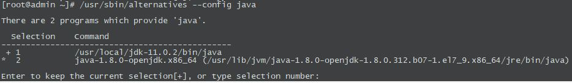

<br />
<div align="center">
  <h3 align="center">ELK installation</h3>
  <p align="left">
    elasticsearch 7.14.1<br>
    kibana 7.14.2<br>
    packetbeat 7.14.0<br>
</div>

## Elasticsearch
### import repository
Add the following to /etc/yum.repos.d/elasticsearch.repo
  ```sh
    [Elasticsearch-7]
	name=Elasticsearch repository for 7.x packages
	baseurl=https://artifacts.elastic.co/packages/7.x/yum
	gpgcheck=1
	gpgkey=https://artifacts.elastic.co/GPG-KEY-elasticsearch
	enabled=1
	autorefresh=1
	type=rpm-md
  ```
### Install Java-11
Check the latest release of (OpenJDK 11)[https://jdk.java.net/11/] before running the commands below: 
  ```sh
  	curl -O https://download.java.net/java/GA/jdk11/9/GPL/openjdk-11.0.2_linux-x64_bin.tar.gz
  ```
 After the download, extract the archive
   ```sh
  	tar -xvf openjdk-11.0.2_linux-x64_bin.tar.gz
  ```
 Move the resulting folder to /usr/local/
   ```sh
  	mv jdk-11.0.2  /usr/local/
  ```
  Set environment variables<br>Add the following to /etc/profile.d/jdk11.sh
   ```sh
  	export JAVA_HOME=/usr/local/jdk-11.0.2
    export PATH=$PATH:$JAVA_HOME/bin
  ```
 
  Source your profile file and check java command
   ```sh
    $ source /etc/profile.d/jdk11.sh
    $ java -version
    openjdk version "11.0.2" 2019-01-15
    OpenJDK Runtime Environment 18.9 (build 11.0.2+9)
    OpenJDK 64-Bit Server VM 18.9 (build 11.0.2+9, mixed mode)
    $ which java
    /usr/bin/java
  ```
  
  Manage Java version
   ```sh
  	update-alternatives --install /usr/bin/java java /usr/local/jdk-11.0.2/bin/java 2
    /usr/sbin/alternatives --config java
  ```
   
  
  
  
