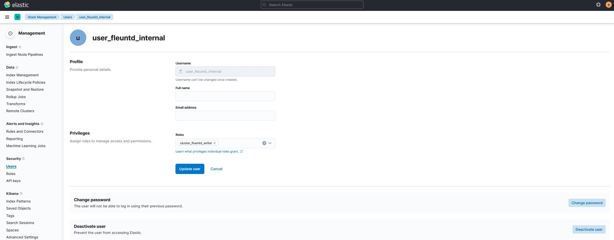

<br />
<div align="center">
  <h3 align="center">Securing Communication between fluentd and Elasticsearch</h3>
</div>
<br>
<div align="center">
   
  </div>


### Create role on elasticsearch 
role name : cluster_fluentd_writer<br>
indice : apache_access_log_result, apache_error_log_result
   ```sh
  	curl -XPOST -u elastic:XiAqjTzAZ8rXOKzc1bI5 -H 'Content-Type: application/json' "http://192.168.1.100:9200/_xpack/security/role/cluster_fluentd_writer?pretty" -d'{"cluster": ["manage_index_templates","monitor"],"indices": [{"names": [ "apache_access_log_result-*","apache_error_log_result-*"],"privileges": ["write","create_index"]}] }'
  ```
  It should return output like this : <br>
<br>
NB : you can verify the last user creation on kibana portal<br>
Stack Management >> Security >> Roles <br>
or <br>
http://192.168.1.100:5601/app/management/security/roles/edit/cluster_fluentd_writer<br>


### Create on elasticsearch user & Assign the writer role to the user
user : user_fleuntd_internal
password : Mdo013SHsdf05sf2
   ```sh
  	curl -XPOST -u elastic:XiAqjTzAZ8rXOKzc1bI5 -H 'Content-Type: application/json' "http://192.168.1.100:9200/_xpack/security/user/user_fleuntd_internal?pretty" -d'{"password" : "Mdo013SHsdf05sf2","roles" : [ "fluentd_writer"],"full_name" : "Internal fluentd User"}'
  ```
  It should return output like this : <br>
<br>

NB : you can verify the last User creation on kibana portal<br>
Stack Management >> Security >> User<br> 
or<br> 
http://192.168.1.100:5601/app/management/security/users/edit/user_fleuntd_internal<br>

<br>

### Add credential on /etc/td-agent/td-agent.conf in <store> section
   ```sh
  <store>
    @type elasticsearch
        host 192.168.1.100  
        port 9200
        user user_fleuntd_internal
        password Mdo013SHsdf05sf2
        include_tag_key true
        logstash_format true
        logstash_prefix apache_access_log_result
        logstash_dateformat %Y%m%d
        flush_interval 1s
  </store>
  ```
 
#### Restart Fluentd service
   ```sh
  	service td-agent restart
  ```
