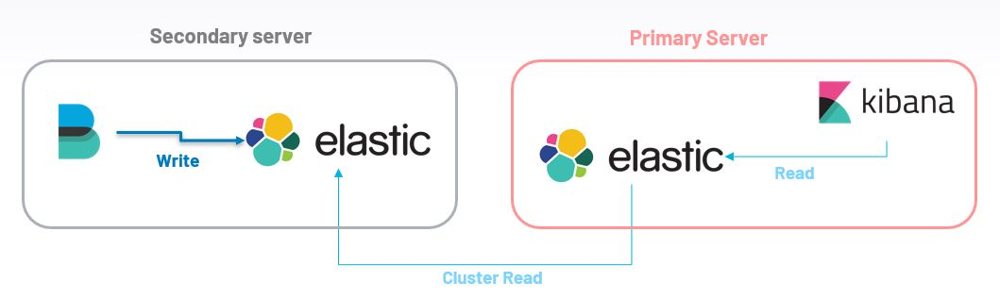
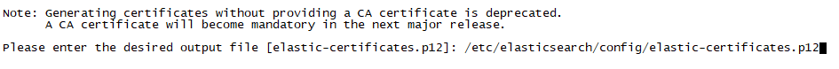
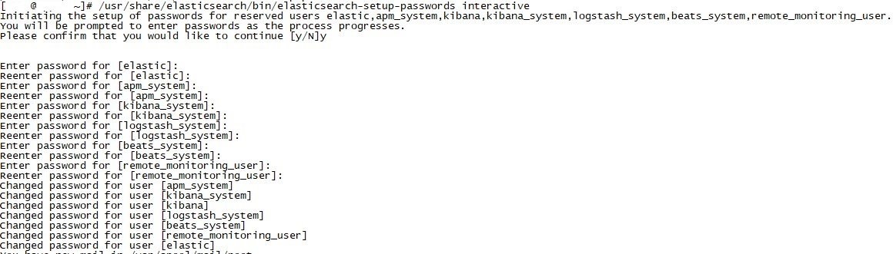
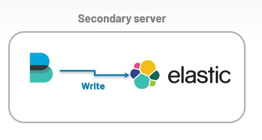
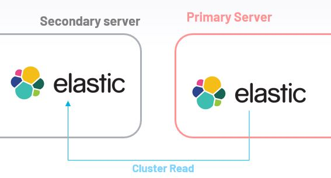
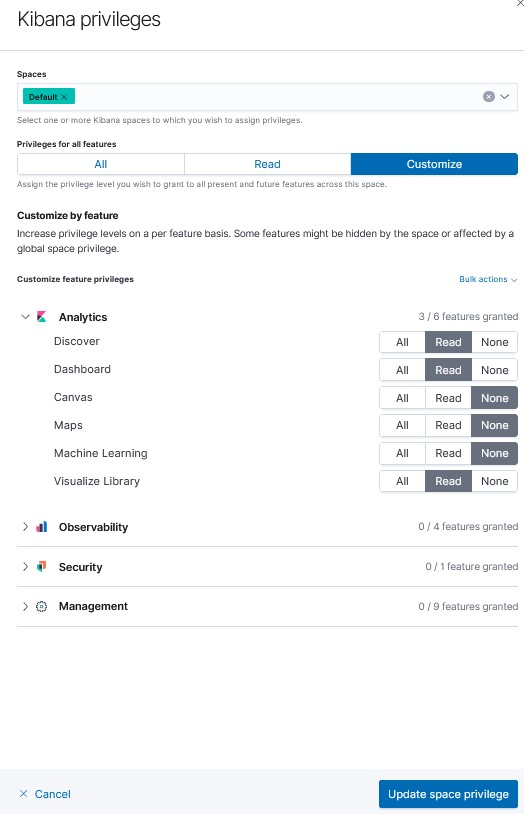

<br />
<div align="center">
  <h3 align="center">Set up basic security for the Elasticsearch</h3><br>
  <p align="left">
    In this tutorial, we are going to encrypt traffic between (elasticseach – kibana) and (elasticseach – packetbeat) in cluster environment<br>
</div>

Scenario
   - Primary Server <br>
       Ip adress      : 192.168.1.100<br>
       elasticsearch  : 192.168.1.100:9200<br>
       Kibana         : 192.168.1.100:5601<br>

   - Secondary Server <br>
       Ip adress      : 192.168.1.101<br>
       elasticsearch  : 192.168.1.101:9200<br>

   
   
## [Elasticsearch]
#### Create Certificate Directory (Primary Server & Secondary Server)
   ```sh
  	mkdir /etc/elasticsearch/config/
  ```
#### Generate TLS Certificate (Primary Server)
   ```sh
  	/usr/share/elasticsearch/bin/elasticsearch-certutil cert
    out : /etc/elasticsearch/config/elastic-certificates.p12
    pass  : ""
    or
    /usr/share/elasticsearch/elasticsearch-certutil cert -out config/elastic-certificates.p12 -pass ""
  ```
  

#### Add privileges (Primary Server)
   ```sh
  	chown -R elasticsearch:elasticsearch /etc/elasticsearch/config/config
  ```
#### TLS on Elasticsearch (Primary Server & Secondary server)
Add this lines on /etc/elasticsearch/elasticsearch.yml
   ```sh
  	xpack.security.enabled: true
    xpack.security.transport.ssl.enabled: true
    xpack.security.transport.ssl.verification_mode: certificate 
    xpack.security.transport.ssl.keystore.path: config/elastic-certificates.p12 
    xpack.security.transport.ssl.truststore.path: config/elastic-certificates.p12 
  ```
#### Transfer config/elastic-certificates.p12 to Secondary server (Primary server)
   ```sh
  	scp -R /etc/elasticsearch/config/elastic-certificates.p12 192.168.1.101:/etc/elasticsearch/config/
  ```
#### set permission (Secondary server)
   ```sh
    chown -R elasticsearch:elasticsearch /etc/elasticsearch/config/
  ```
#### Creat password for elastic cluster (Primary server)
   ```sh
  	/usr/share/elasticsearch/bin/elasticsearch-setup-passwords auto
  ```
  result: (nb : the following password generated randomize from elasticsearch-setup-passwords )
   ```sh
Changed password for user apm_system
PASSWORD apm_system = x2YhXMDfXnJwa8VFZ7rl
Changed password for user kibana_system
PASSWORD kibana_system = OnGPpEa9rF5rZE72bpqM
Changed password for user kibana
PASSWORD kibana = G7pPrZE2b5rMFEa9nqOp
Changed password for user logstash_system
PASSWORD logstash_system = IPQn9tDF9nZ4ZQgkuoUb
Changed password for user beats_system
PASSWORD beats_system = mANJ1OVhMBUhRk45Rjlm
Changed password for user remote_monitoring_user
PASSWORD remote_monitoring_user = oGz552Zyg5ED8vYdnSkh
Changed password for user elastic
PASSWORD elastic = XiAqjTzAZ8rXOKzc1bI5

  ```
#### Creat password for elastic cluster (Secondary Server) [for testing purpose chose the same passwords as Primary server]
/usr/share/elasticsearch/bin/elasticsearch-setup-passwords interactive

  

#### Restart Elasticsearch service (Primary Server & Secondary Server)
   ```sh
  	service elasticsearch restart
  ```
## [Kibana] 
#### Add definition ccredential on /etc/kibana/kibana.yml  (Primary Server)
   ```sh
  	elasticsearch.username: "elastic"
    elasticsearch.password: "XiAqjTzAZ8rXOKzc1bI5"
  ```
#### Restart Kibana service (Primary Server)
   ```sh
  	service kibana restart
  ```
  
## [Packetbeat] 
### Configure Authentication credential between Packetbeat and Elasticsearch (Secondary Server)<br>
> (Packetbeat write to elasticsearch)<br>


NB : No Kibana installed on Secondary server, we have configure just by API command line<br>
#### Create role <br>
index name = clstr_packetbeat_secondary_server_* <br>
role name = packetbeat_writer
   ```sh
  	curl -XPOST -u elastic:XiAqjTzAZ8rXOKzc1bI5 -H 'Content-Type: application/json' "http://192.168.1.101:9200/_xpack/security/role/packetbeat_writer?pretty" -d'{"cluster": ["manage_index_templates","monitor"],"indices": [{"names": [ "clstr_packetbeat_secondary_server_*" ],"privileges": ["write","create_index"]}] }'
  ```
It should return output like this : <br>


#### Create user & Assign the writer role to the user : <br>
user : user_packetbeat_internal_secondary_server <br>
password : DHdk50dsSDFgiSDf <br>
role name = packetbeat_writer
   ```sh
  	curl -XPOST -u elastic:XiAqjTzAZ8rXOKzc1bI5 -H 'Content-Type: application/json' "http://192.168.1.101:9200/_xpack/security/user/user_packetbeat_internal_secondary_server?pretty" -d'{"password" : "DHdk50dsSDFgiSDf","roles" : [ "packetbeat_writer","kibana_admin"],"full_name" : "Internal Packetbeat User Secondary server"}'
  ```
  It should return output like this : <br>


#### Add login credential on /etc/packetbeat/packetbeat.yml (output.elasticsearch section) (Secondary Server)
   ```sh
  	hosts: ["192.168.1.101:9200"]
    username: "user_packetbeat_internal_secondary_server"
    password: "DHdk50dsSDFgiSDf"
  ```
 #### Restart Packetbeat service (secondary Server)
   ```sh
  	service packetbeat restart
  ```
### Configure Authentication credential between Elasticsearch(Primary server) and Elasticsearch(Secondary Server)<br>
> (Packetbeat write to elasticsearch)<br>


#### Add packetbeat_monitor_secondary_server role to read remote_cluster_secondary_server:clst_* & kibana read privileges (Primary Server)
   ```sh
  	curl -XPOST -u elastic:XiAqjTzAZ8rXOKzc1bI5 -H 'Content-Type: application/json' "http://192.168.1.100:9200/_xpack/security/role/packetbeat_monitor_secondary_server?pretty" -d'{ "indices": [ { "names": [ "remote_cluster_secondary_server:clstr_*" ], "privileges": ["read","view_index_metadata"] } ] ,"applications" : [ { "application" : "kibana-.kibana", "privileges" : [ "feature_dashboard.read", "feature_visualize.read", "feature_discover.read" ], "resources" : [ "space:default" ] } ] }'
  ```
  You can also add kibana privileges for user interface following this section : Stack Management >> Security >> Roles 
  

#### Add packetbeat_monitor_secondary_server role to read remote_cluster_secondary_server:clst_* (Secondary server)
 ```sh
curl -XPOST -u elastic:XiAqjTzAZ8rXOKzc1bI5 -H 'Content-Type: application/json' "http://192.168.1.100:9200/_xpack/security/role/packetbeat_monitor_secondary_server?pretty" -d'{ "indices": [ { "names": [ "remote_cluster_secondary_server*" ], "privileges": ["read","view_index_metadata"] } ] }'
  ```
  

#### NB : This repository contain the important parameters in config files : 
https://github.com/secfit/elk/tree/main/config
